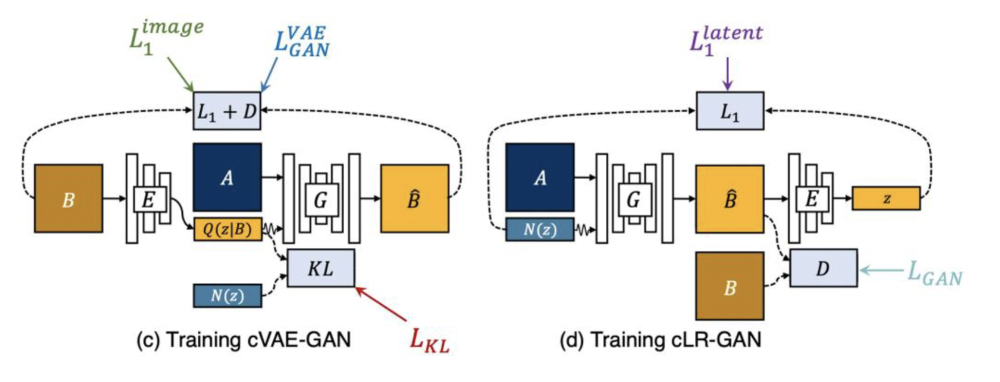
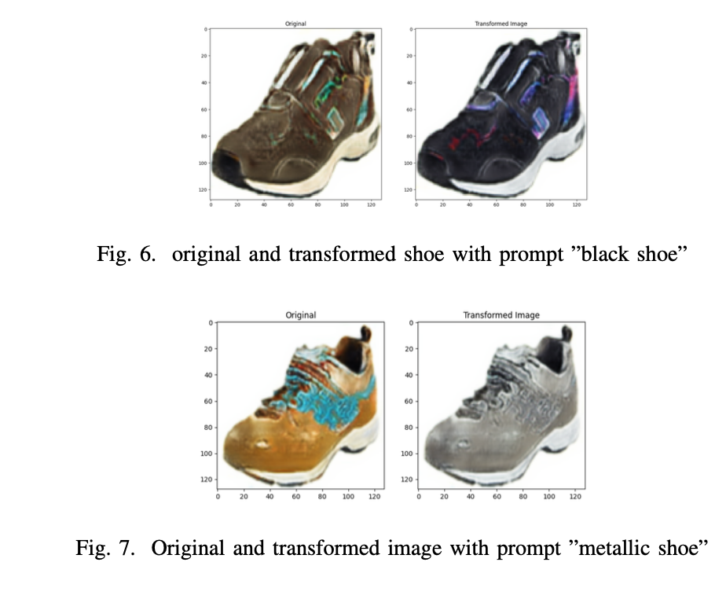
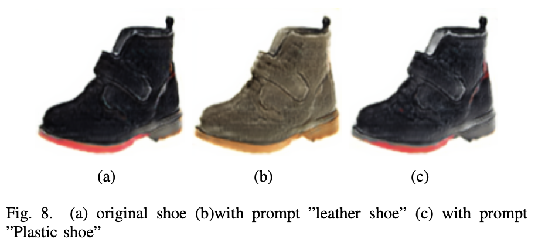
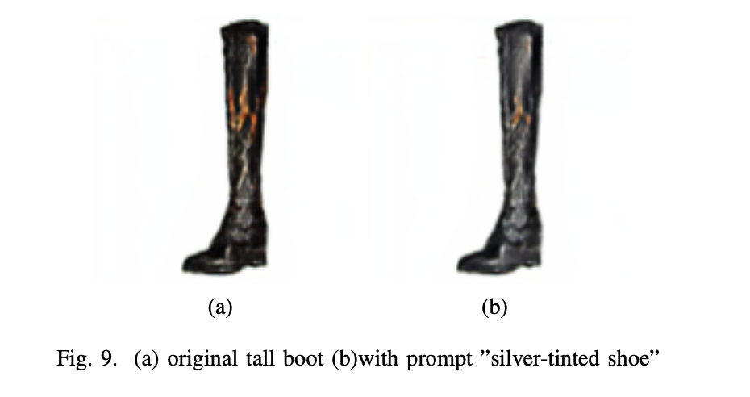

# CLIP-Guided-BicycleGAN

Multimodal Image translation with the additional ability to be able to guide generated outputs using CLIP. 

  
|</img>| 
|:--:| 
|*BicycleGAN Architecture from Toward Multimodal Image-to-Image Translation (Zhue et al.)*|

|</img> | 
|:--:| 
|*Diverse Outputs from Edge2Shoes*|

## CLIP Guided BicycleGAN Outputs

BicycleGAN allows us to generate diverse outputs given an image in the input domain. However, how do we get output images according to our own desires? For example, if we want the model to output a white shoe, can we explicitly specify this via text? We show that this is indeed possible, using CLIP to search BicycleGAN's latent space. We were able to achieve this for a wide variety of prompts, post-hoc, without having to modify the weights of the model.

| </img>| 
|:--:| 
|*Color Based Prompts*|

| </img>| 
|:--:| 
|*Texture/Material Based Prompts*|

|</img>| 
|:--:| 
|*Prompts with Fine Details*|

Please see the notebook and report for more details! You may also check out our video.

# Running the Code
The notebook has been set up so that it can be run from the top sequentially.

Please upload the provided checkpoint file as well into the /content directory. You can find it here:
https://drive.google.com/drive/folders/1pLoj37ghFYQSm-cuBMHGianwrpe29Ha6?usp=drive_link

Please make sure that a GPU is accessible as some sections of the code are GPU dependent
